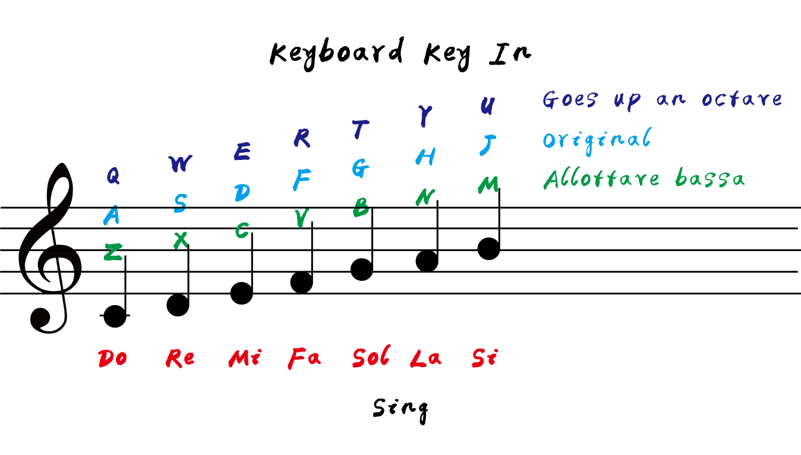

# Keyboard Piano
按下鍵盤上特定的按鍵
來演奏出鋼琴的簡單樂曲
另外也可以試著練習和弦

# 指引

1. Goes up an octare：高八度，所需之按鈕。

2. Original：正常一般音域。

3. Allotare bassa：低八度，所需之按鈕

## 相關連結（Links）

1. [KeyboardPiano](https://liugoldent.github.io/KeyboardPiano/music.html)

## Using

- [X] [JS]
- [X] [GarageBand]（MacOS軟體）
- [X] [Photoshop]（Adobe軟體）
- [X] [illustrator]（Adobe軟體）

